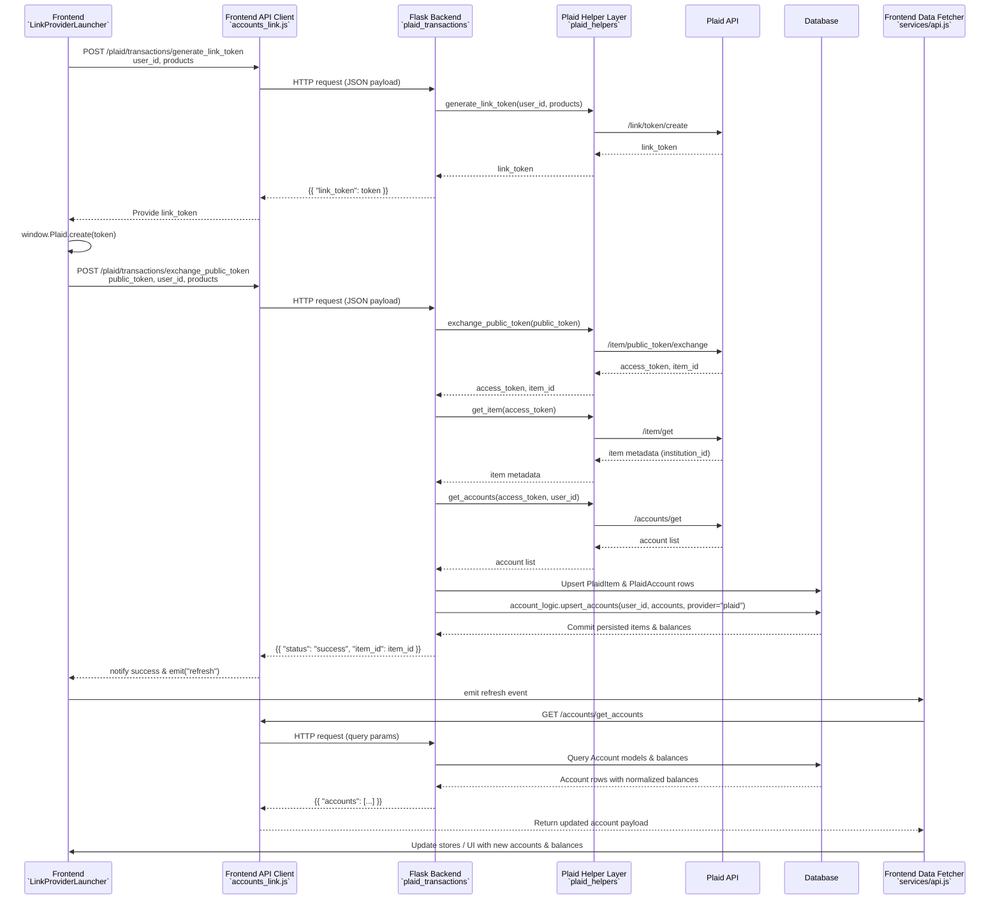

# Plaid Link Request Flow

This diagram traces how the Plaid Link onboarding request moves through the stack—from the Vue frontend initializer, into the Flask backend, out to Plaid, and back into the database before refreshed data is served to the UI.

**Key touchpoints**

- **Frontend initializer**: `LinkProviderLauncher.vue` loads the Plaid script, requests a link token, and opens the Plaid Link modal. Upon success it calls `exchangePublicToken` and emits a refresh event back to parent components. 【F:frontend/src/components/forms/LinkProviderLauncher.vue†L1-L84】
- **Backend routes**: `/plaid/transactions/generate_link_token` and `/plaid/transactions/exchange_public_token` live in `plaid_transactions.py`, orchestrating Plaid helper calls, upserting `PlaidItem` / `PlaidAccount` records, and delegating to `account_logic.upsert_accounts` for core account persistence. 【F:backend/app/routes/plaid_transactions.py†L45-L214】
- **Plaid helper layer**: `plaid_helpers.py` wraps Plaid SDK calls used in the flow (link token creation, public token exchange, item/accounts retrieval). 【F:backend/app/helpers/plaid_helpers.py†L56-L143】
- **Database upsert**: `account_logic.upsert_accounts` normalizes account payloads, writes to `Account` and `AccountHistory`, and logs progress. 【F:backend/app/sql/account_logic.py†L118-L223】
- **Frontend data serving**: After emitting a refresh, the UI pulls `/accounts/get_accounts` through `services/api.js`, which returns normalized account rows for display. 【F:frontend/src/services/api.js†L10-L18】【F:backend/app/routes/accounts.py†L464-L512】
